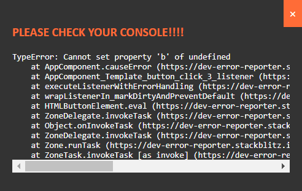

# Dev Error Reporters

## Dev error handler

A tool to make errors more visible during development.
The idee behind this is to have visibility and ensure errors get attended to quickly.

The error handler ensures that the same error does not get logged twice, once the error gets dismissed it will show again when it happens.



### Demo
https://dev-error-reporter.stackblitz.io/

### Install

> `npm i dev-error-reporter`

### Simple Usage

```js
const errorReporter = new DevErrorHandler();
errorReporter.showError(error);
```

### Usage Angular

```ts
@Injectable({ provideIn: 'root' })
export class GlobalErrorHandler extends ErrorHandler {
  // Creates new instance, the instance ensures errors are not shown twice until dismisses
  private errorReporter = new DevErrorHandler({
    appendToElement: 'app-root', // <-- App root as defined in index.html
  });

  handleError(error: any) {
    if (environment.showDevErrors) {
      // <-- Managed in your own code, should never show in prod
      this.errorReporter.showError(error);
    }

    // Keep default behavior
    super.handleError(error);
  }
}
```

# Coming soon:

## Debug popups

Error popups are typically used in a Testing Environment so that testers can give more context on issues occurring in the application
